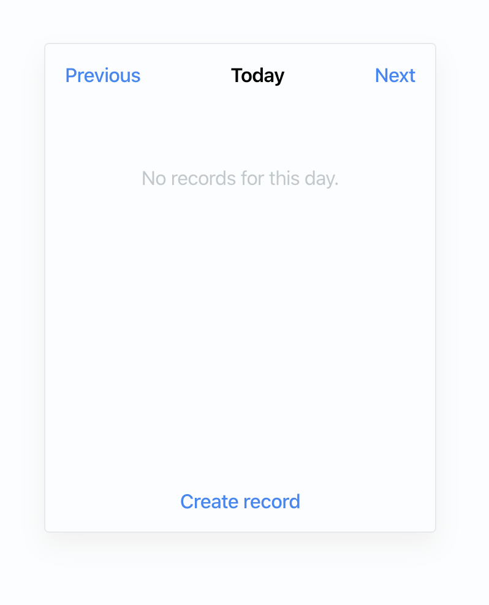

# react-swiftui

SwiftUI has really nice API. You can build UIs by combination of `Text`, `HStack`, `VStack` and many more. When I first saw it, it reminded me of Flexbox model of course.

This library lets you build web apps by using SwiftUI-like API. It will translate into standard CSS, but the idea is that you don't have to write CSS. It's SwiftUI, implemented in React!

## Why use this?

- Use same building blocks as you would use on Apple platforms. This is almost as if you were using the same language to describe your UIs!
- Don't write CSS. Don't switch between languages, and don't switch between files. Describe your UI with one language.
- Prototype rapidly. It might be harder to get those pixel-perfect details right, but this library would be perfect for making an app in a single evening.

## Usage example

Say you want to build a simple, iOS-like UI in your web app:



You can do it without writing any CSS at all, and while making your code look like it was taken straight out of WWDC presentation:

```tsx
const Link = (props) => (
  <Text
    color={Color.blue}
    fontWeight={FontWeight.medium}
  >
    {props.children}
  </Text>
);

const Message (props) => (
  <Text padding={50} color={ProjectColor.messageGray}>
    {props.children}
  </Text>
);

const App = (props) => (
  <Group
    border={{color: ProjectColor.borderGray, width: 1, cornerRadius: 4}}
    frame={{height: 400, width: 320}}
    shadow={{color: ProjectColor.shadowGray, radius: 20, x: 0, y: 10}}
  >
    <VStack>
      <HStack padding alignment={VerticalAlignment.center}>
        <Link>Previous</Link>

        <Spacer />

        <Text fontWeight={FontWeight.semibold}>Today</Text>

        <Spacer />

        <Link>Next</Link>
      </HStack>

      <Message>No records for this day.</Message>

      <Spacer />

      <Group padding>
        <Link>Create record</Link>
      </Group>
    </VStack>
  </Group>
);
```

## Can I use this?

For now, this is proof of concept and I only implemented a few components. However, I'm planning to use this in my side projects and will be improving it as I go.

You are welcome to contribute to the project! Feel free to get in touch with me at [vojto@rinik.net](mailto:vojto@rinik.net).